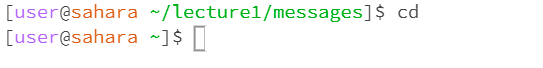
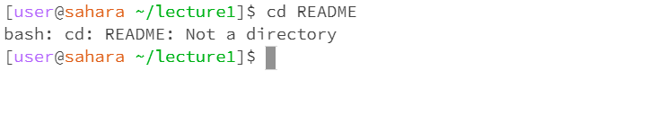
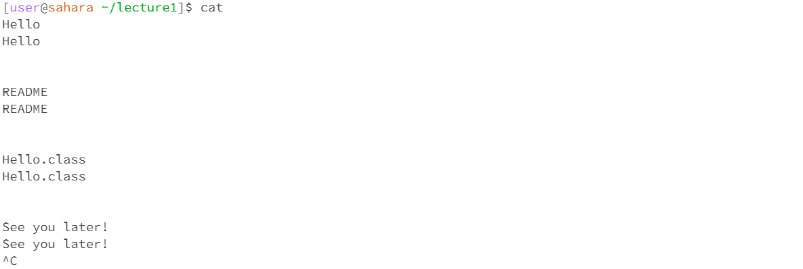
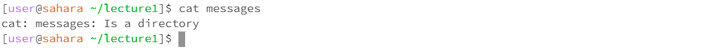

# Lab Report 1 - Remote Access and FileSystem (Week 1)
## `cd`
1. No Arguments
   * Screenshot:  
    
   * When the command was run, the working directory was `/home/lecture1/messages`.
   * My working directory was changed to the root directory because cd stands for "change directory", and, since I did not specify a directory, cd defaulted to the root directory. I am assuming that a root directory is a given in a linux filesystem, so, when a directory is not specified, the terminal defaults to a directory that is known to exist.
   * Output is not an error.
2. Path to a Directory as an Argument
   * Screenshot:  
    
   * When the command was run, the working directory was `/home`.
   * My working directory was changed to `/home/lecture1` because cd stands for "change directory", and, since I specified the relative path to the `lecture1` directory, cd changed my working directory to the specified directory.
   * Output is not an error.
3. Path to a File as an Argument
   * Screenshot:  
    
   * When the command was run, the working directory was `/home/lecture1`.
   * The terminal printed `bash: cd: README: Not a directory` because cd stands for "change directory", so cd takes a directory, not a file, as input.
   * Output is not an error.

## `ls`
1. No Arguments:
   * Screenshot:  
    
   * When the command was run, the working directory was `/home/lecture1`.
   * The terminal listed the files and folders in the working directory because ls stands for "list", and, since I did not specify a directory, ls defaulted to the current working directory. I am assuming that ls defaults to the current working directory because it is convenient and because ls can assume the current working directory exists; you would not be able to access the current working directory if it did not exist.
   * Output is not an error.
2. Path to a Directory as an Argument:
   * Screenshot:  
    
   * When the command was run, the working directory was `/home/lecture1`.
   * The terminal listed the files and folders in the `/home/lecture1/messages` directory because ls stands for "list", and, since I specified the relative path to the `messages` directory, ls listed the files and folders in the specified directory.
   * Output is not an error.
3. Path to a File as an Argument
   * Screenshot:  
    
   * When the command was run, the working directory was `/home/lecture1`.
   * The terminal listed `README` because ls stands for "list", and, since I specified the relative path to the `README` file, ls listed the specified file. I am assuming that running ls with a path to a file as an argument is like a search function and can be used to check if a certain file is in a certain directory.
   * Output is not an error.

## `cat`
1. No Arguments:
   * Screenshot:  
     
   * When the command was run, the working directory was `/home/lecture1`.
   * My cursor jumped to a new line with no prompt; whatever I typed and entered was printed back to me in the terminal. I had to press ctrl-c to interrupt cat, exit the prompt free space, and have my cursor jump to a new line with a prompt. I am assuming the cat command does not know what to do when there is no argument. I think cat gets stuck running without terminating because cat stands for "concatenate" and works by concatenatenating and printing out files, and, when cat was stuck running, everything I entered in the prompt free space was echoed back to me. Additionally, I had to interrupt cat to regain control of the terminal.
   * The output is an error because the cat command was stuck running; I had to interrupt cat using ctrl-c in order to regain control of the terminal.
2. Path to a Directory as an Argument:
   * Screenshot:  
     
   * When the command was run, the working directory was `/home/lecture1`.
   * The terminal printed "cat: messages: Is a directory" when I tried to run the cat command using the relative path to `messages` as an argument. Since cat stands for "concatenate" and works by concatenating the contents of a file and printing them to the terminal, it makes sense that cat would not work with a path to a directory as an argument because cat is expecting its arguments to be paths to files. Additionally, the contents of a folder can be printed to the terminal using `ls`.
   * Output is not an error.
4. Path to a File as an Argument:
   * Screenshot:  
    
   * When the command was run, the working directory was `/home/lecture1`.
   * The terminal printed the contents of the README file because cat stands for "concatenate", and, since I specified the relative path to the `README` file, cat concatenated the contents of the specified file and printed them to the terminal.
   * Output is not an error.
