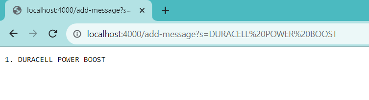
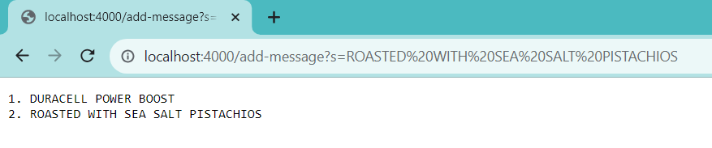
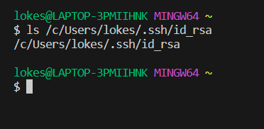
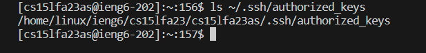
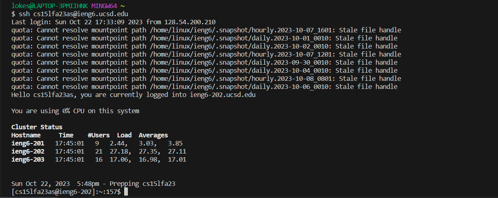

# Lab Report 2 - Servers and SSH Keys (Week 3)
## `Part 1`
StringServer Code:
```
import java.io.IOException;
import java.net.URI;

class Handler implements URLHandler
{
    int num = 1;
    String output = "";
    public String handleRequest(URI url)
    {
        if(url.getPath().equals("/"))
            return output;
        else 
        {
            if(url.getPath().contains("/add-message"))
            {
                String[] parameters = url.getQuery().split("=");
                if(parameters[0].equals("s"))
                {
                    output += String.format("%d. %s\n", num, parameters[1]);
                    num += 1;
                    return output;
                }
            }
            return "404 ERROR";
        }
    }
}

class NumberServer {
    public static void main(String[] args) throws IOException {
        if(args.length == 0){
            System.out.println("Missing port number! Try any number between 1024 to 49151");
            return;
        }

        int port = Integer.parseInt(args[0]);

        Server.start(port, new Handler());
    }
}
```
1. Screenshot:
   ***
   
   * Methods Called: handleRequest
   * Relevant Arguments: The URI url argument was passed localhost:4000/add-message?s=DURACELL%20POWER%20BOOST.
   * Values of Relevant Fields of the Class: The value of output had "1. DURACELL POWER BOOST\n" appended to its end, and then the value of num was incremented by 1 to 2.
3. Screenshot:
   ***
   
   * Methods Called: handleRequest
   * Relevant Arguments: The URI url argument was passed localhost:4000/add-message?s=ROASTED%20WITH%20SEA%20SALT%20PISTACHIOS.
   * Values of Relevant Fields of the Class: The value of output had "2. ROASTED WITH SEA SALT PISTACHIOS\n" appended to its end, and then the value of num was incremented by 1 to 3.
## `Part 2`
* The path to the *private* key for my SSH key for logging into **ieng6**
  
  ***Note!** I am accessing /c/Users/lokes because this used to be my brother's laptop; his name is Lokesh Kumaraguru. I never got around to setting up my own account, so all my files are under his account in /c/Users/lokes.*
* The path to the *public* key for my SSH key for logging into **ieng6**
  
* A terminal interaction where I long into **ieng6** with my course-specific account without being asked for a password
  
  ***Note!** I am accessing /c/Users/lokes because this used to be my brother's laptop; his name is Lokesh Kumaraguru. I never got around to setting up my own account, so all my files are under his account in /c/Users/lokes.*
