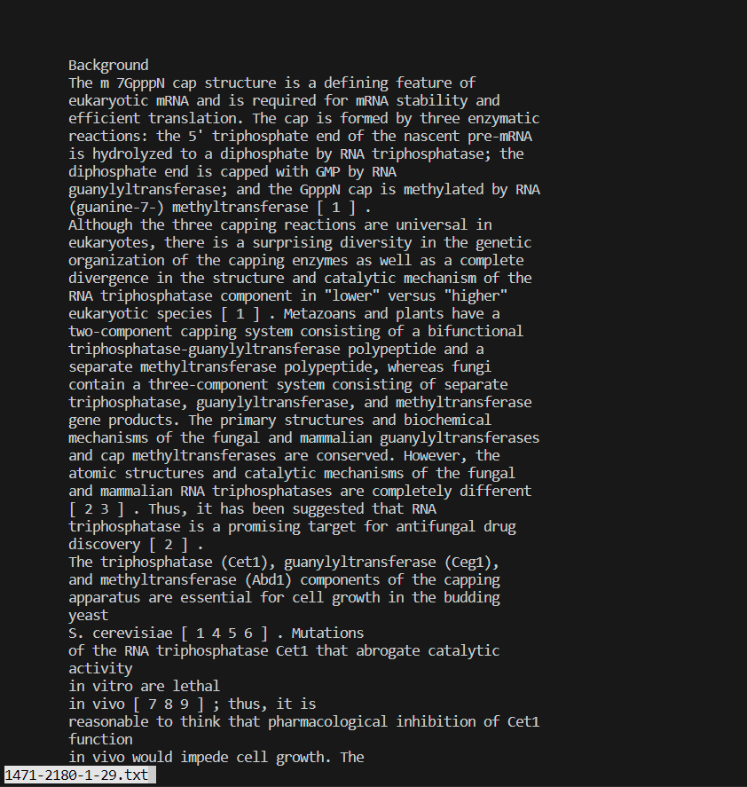
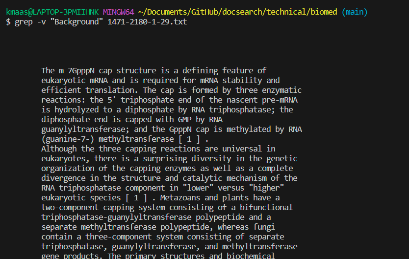
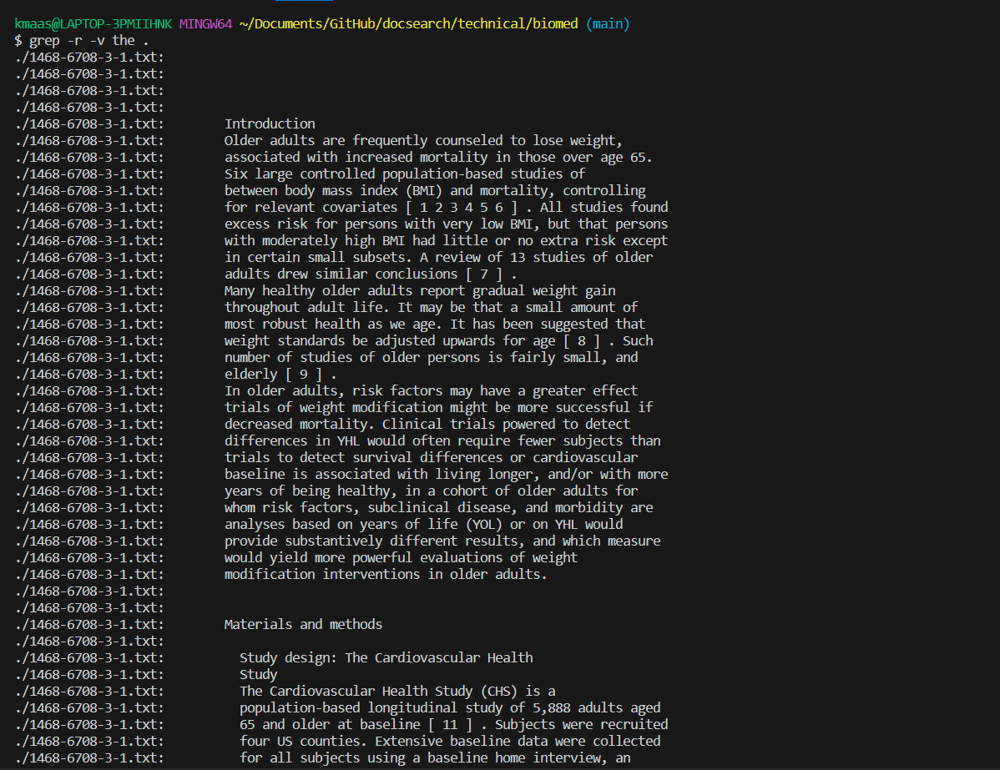
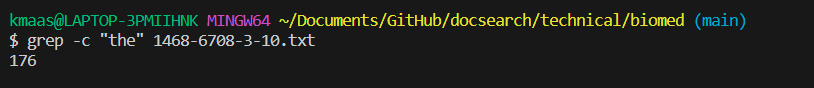
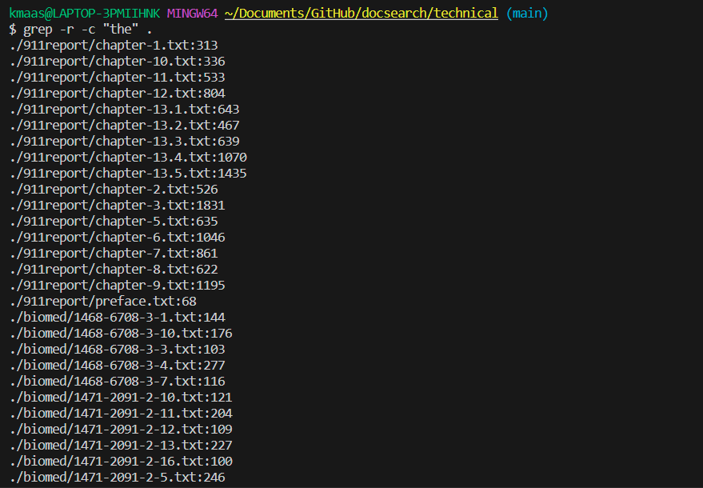
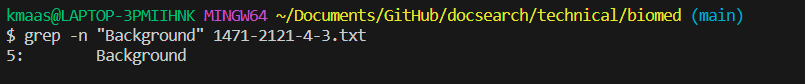
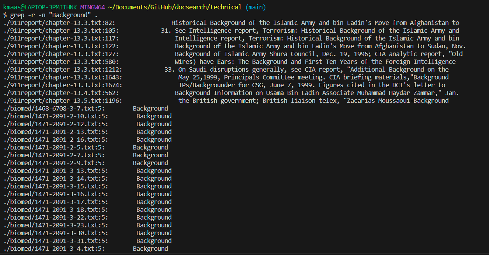

# Lab Report 3 - Bugs and Commands (Week 5)  
## `Part 1`  
* A failure-inducing input for the buggy program, as a JUnit test and any associated code:  
```  
  //failure-inducing input
  @Test
  public void testMerge_failureInducing() {
    List<String> input1 = new ArrayList<>();
    input1.add("a");
    input1.add("c");
    List<String> input2 = new ArrayList<>();
    input2.add("b");
    input2.add("d");
    List<String> expectedOutput = new ArrayList<>();
    expectedOutput.add("a");
    expectedOutput.add("b");
    expectedOutput.add("c");
    expectedOutput.add("d");
    List<String> output = ListExamples.merge(input1, input2);
    assertEquals(expectedOutput, output);
  }
```  
* An input that _doesn't_ induce a failure, as a JUnit test and any associated code:  
```  
  //non-failure-inducing input
  @Test
  public void testMerge_nonFailureInducing() {
    List<String> input1 = new ArrayList<>();
    input1.add("a");
    input1.add("c");
    List<String> input2 = new ArrayList<>();
    List<String> expectedOutput = new ArrayList<>();
    expectedOutput.add("a");
    expectedOutput.add("c");
    List<String> output = ListExamples.merge(input1, input2);
    assertEquals(expectedOutput, output);
  }
```  
* The symptom, as the output of running the tests:  
  
* The bug, as the before-and-after code change required to fix it:  
* * Before code change:  
    ```
  // Takes two sorted list of strings (so "a" appears before "b" and so on),
  // and return a new list that has all the strings in both list in sorted order.
  static List<String> merge(List<String> list1, List<String> list2) {
    List<String> result = new ArrayList<>();
    int index1 = 0, index2 = 0;
    while(index1 < list1.size() && index2 < list2.size()) {
      if(list1.get(index1).compareTo(list2.get(index2)) < 0) {
        result.add(list1.get(index1));
        index1 += 1;
      }
      else {
        result.add(list2.get(index2));
        index2 += 1;
      }
    }
    while(index1 < list1.size()) {
      result.add(list1.get(index1));
      index1 += 1;
    }
    while(index2 < list2.size()) {
      result.add(list2.get(index2));
      index1 += 1;
    }
    return result;
  }
    ```  
  * After code change:  
    ```
  // Takes two sorted list of strings (so "a" appears before "b" and so on),
  // and return a new list that has all the strings in both list in sorted order.
  static List<String> merge(List<String> list1, List<String> list2) {
    List<String> result = new ArrayList<>();
    int index1 = 0, index2 = 0;
    while(index1 < list1.size() && index2 < list2.size()) {
      if(list1.get(index1).compareTo(list2.get(index2)) < 0) {
        result.add(list1.get(index1));
        index1 += 1;
      }
      else {
        result.add(list2.get(index2));
        index2 += 1;
      }
    }
    while(index1 < list1.size()) {
      result.add(list1.get(index1));
      index1 += 1;
    }
    while(index2 < list2.size()) {
      result.add(list2.get(index2));
      index2 += 1;
    }
    return result;
  }
    ```   


failure-inducing
```
import static org.junit.Assert.*;
import org.junit.*;

import java.util.ArrayList;
import java.util.List;

public class ListTests {
  //failure-inducing input
  @Test
  public void testMerge_failureInducing() {
    List<String> input1 = new ArrayList<>();
    input1.add("a");
    input1.add("c");
    List<String> input2 = new ArrayList<>();
    input2.add("b");
    input2.add("d");
    List<String> expectedOutput = new ArrayList<>();
    expectedOutput.add("a");
    expectedOutput.add("b");
    expectedOutput.add("c");
    expectedOutput.add("d");
    List<String> output = ListExamples.merge(input1, input2);
    assertEquals(expectedOutput, output);
  }
```
doesn't induce a failure
```
  //non-failure-inducing input
  @Test
  public void testMerge_nonFailureInducing() {
    List<String> input1 = new ArrayList<>();
    input1.add("a");
    input1.add("c");
    List<String> input2 = new ArrayList<>();
    List<String> expectedOutput = new ArrayList<>();
    expectedOutput.add("a");
    expectedOutput.add("c");
    List<String> output = ListExamples.merge(input1, input2);
    assertEquals(expectedOutput, output);
  }
}
```
symptom

before bug
```
  // Takes two sorted list of strings (so "a" appears before "b" and so on),
  // and return a new list that has all the strings in both list in sorted order.
  static List<String> merge(List<String> list1, List<String> list2) {
    List<String> result = new ArrayList<>();
    int index1 = 0, index2 = 0;
    while(index1 < list1.size() && index2 < list2.size()) {
      if(list1.get(index1).compareTo(list2.get(index2)) < 0) {
        result.add(list1.get(index1));
        index1 += 1;
      }
      else {
        result.add(list2.get(index2));
        index2 += 1;
      }
    }
    while(index1 < list1.size()) {
      result.add(list1.get(index1));
      index1 += 1;
    }
    while(index2 < list2.size()) {
      result.add(list2.get(index2));
      index1 += 1;
    }
    return result;
  }
```
after bug
```
  // Takes two sorted list of strings (so "a" appears before "b" and so on),
  // and return a new list that has all the strings in both list in sorted order.
  static List<String> merge(List<String> list1, List<String> list2) {
    List<String> result = new ArrayList<>();
    int index1 = 0, index2 = 0;
    while(index1 < list1.size() && index2 < list2.size()) {
      if(list1.get(index1).compareTo(list2.get(index2)) < 0) {
        result.add(list1.get(index1));
        index1 += 1;
      }
      else {
        result.add(list2.get(index2));
        index2 += 1;
      }
    }
    while(index1 < list1.size()) {
      result.add(list1.get(index1));
      index1 += 1;
    }
    while(index2 < list2.size()) {
      result.add(list2.get(index2));
      index2 += 1;
    }
    return result;
  }
```
The fix addresses the issue because the issue was the fact that the last while never terminated. This was because index1 was being incremented while we were waiting for index2 to get larger than list2.size().
In order for the while to terminate, we would need to do something that actually affects the while statement; incrementing index2 affects the while statement as index2 will eventually get larger than list2.size()
and the while will terminate. Thus, the issue of the last while not terminating will be solved.


-r: recursively searches for the specified phrase in the specified directory and its sub-directories

returned the line that contained the specified phrase not different from without -r, so not very useful

```
grep -r "Recent U.S. national surveys" 1471-244X-2-9.txt
```
returned two lines each from a different file in the specified directory and its sub directories that contained the specified phrase useful fro searching directories

current directory is ~/Documents/GitHub/docsearch/technical
```
grep -r "U.S. national" .
```
Note that I specify -r in addition to -c because otherwise the command wouldn't work with a directory as input
could use to make sure a filesystem doesn't contain a certain phrase or that you deleted all instances of x from the filesystem. (If there is not output the phrase isn't there)

-v: returned all the lines that didn't contain the specified phrase
useful for checking for unique lines in a file that deviates from what may be expected

Note that the first line with text in the file is "Background".


```
grep -v "Background" 1471-2180-1-29.txt
```
prints all the lines in the specified file expect for lines containing the specified phrase
useful for searching for a unique line maybe
Could be used to print another file that doesn't contain the specified phrase


current directory is ~/Documents/GitHub/docsearch/technical/biomed
```
grep -r -v the .
```
prints all the lines in the files in the specified directory and its sub directories that don't contain the specified phrase
useful for checking for unique phrases in a batch of files
Could be used to make sure that a file doesn't contain a certain phrase


same thing but recursively for all files in a fir and its sub dir useful for checking for unique lines in batches of files
Could be used to make sure that every file in a filesystem if formatted correctly (e.g. all lines in every file in this filesystem should end in an a)

-c: counts the number of lines which contain the specified phrase

```
grep -c "the" 1468-6708-3-10.txt
```
prints the number of lines that contain the specified phrase in the specified file
useful for getting the counts of a specific phrase
Maybe it could be used in a for loop to replace a certain phrase in a file. I.e for x number of times search for specified phrase and replace it with another phrase. Where x = grep -c "the" 1468-6708-3-10.txt.


current directory is ~/Documents/GitHub/docsearch/technical
```
grep -r -c "the" .
```
prints the number of lines that contain the specified phrase for each file in the specified directory and its sub directories
useful for getting the counts of a specific phrase in a batch of files
Maybe could be used to find the total number of the phrase in the entire directory and its sub directories


-n: prints the line in which the specified phrase is located

```
grep -n "Background" 1471-2121-4-3.txt
```
prints the specified phrase and the line it appears in
useful for checking where exactly a phrase might be in a file
Maybe it could be used to find a phrase in a file and then copy only the text after that phrase


current directory is ~/Documents/GitHub/docsearch/technical
```
grep -r -n "Background" .
```
prints the specfied phrase and file in the specified directory and its sub directories that it appears in
useful for checking exactly where a phrase may be in a batch of files
Maybe it could be used to search specifically for files that have a certain phrase on a certain line


