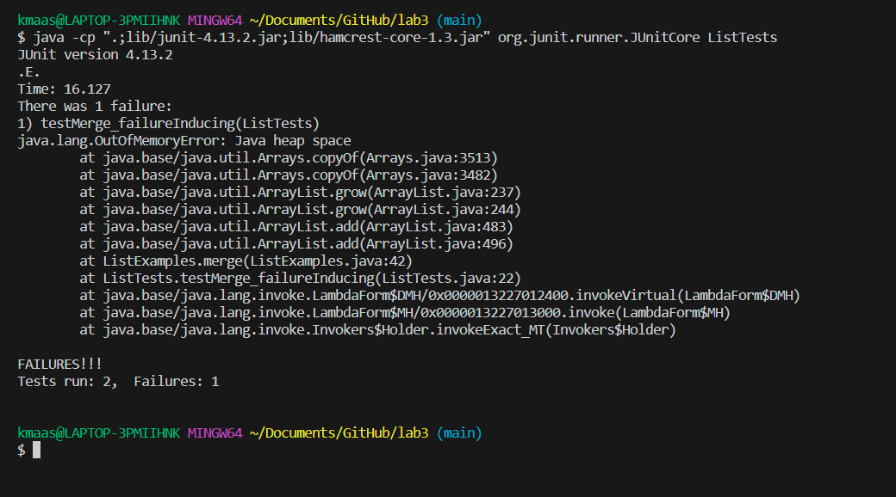
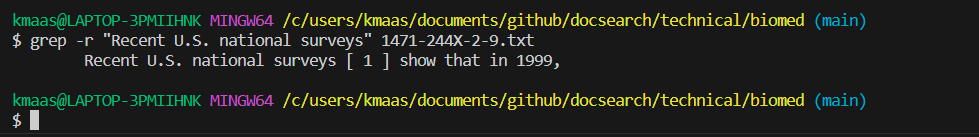
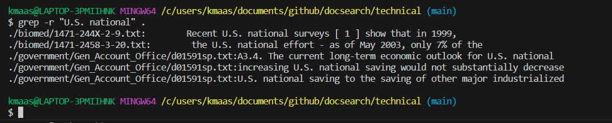

failure-inducing
```
import static org.junit.Assert.*;
import org.junit.*;

import java.util.ArrayList;
import java.util.List;

public class ListTests {
  //failure-inducing input
  @Test
  public void testMerge_failureInducing() {
    List<String> input1 = new ArrayList<>();
    input1.add("a");
    input1.add("c");
    List<String> input2 = new ArrayList<>();
    input2.add("b");
    input2.add("d");
    List<String> expectedOutput = new ArrayList<>();
    expectedOutput.add("a");
    expectedOutput.add("b");
    expectedOutput.add("c");
    expectedOutput.add("d");
    List<String> output = ListExamples.merge(input1, input2);
    assertEquals(expectedOutput, output);
  }
```
doesn't induce a failure
```
  //non-failure-inducing input
  @Test
  public void testMerge_nonFailureInducing() {
    List<String> input1 = new ArrayList<>();
    input1.add("a");
    input1.add("c");
    List<String> input2 = new ArrayList<>();
    List<String> expectedOutput = new ArrayList<>();
    expectedOutput.add("a");
    expectedOutput.add("c");
    List<String> output = ListExamples.merge(input1, input2);
    assertEquals(expectedOutput, output);
  }
}
```
symptom

before bug
```
  // Takes two sorted list of strings (so "a" appears before "b" and so on),
  // and return a new list that has all the strings in both list in sorted order.
  static List<String> merge(List<String> list1, List<String> list2) {
    List<String> result = new ArrayList<>();
    int index1 = 0, index2 = 0;
    while(index1 < list1.size() && index2 < list2.size()) {
      if(list1.get(index1).compareTo(list2.get(index2)) < 0) {
        result.add(list1.get(index1));
        index1 += 1;
      }
      else {
        result.add(list2.get(index2));
        index2 += 1;
      }
    }
    while(index1 < list1.size()) {
      result.add(list1.get(index1));
      index1 += 1;
    }
    while(index2 < list2.size()) {
      result.add(list2.get(index2));
      index1 += 1;
    }
    return result;
  }
```
after bug
```
  // Takes two sorted list of strings (so "a" appears before "b" and so on),
  // and return a new list that has all the strings in both list in sorted order.
  static List<String> merge(List<String> list1, List<String> list2) {
    List<String> result = new ArrayList<>();
    int index1 = 0, index2 = 0;
    while(index1 < list1.size() && index2 < list2.size()) {
      if(list1.get(index1).compareTo(list2.get(index2)) < 0) {
        result.add(list1.get(index1));
        index1 += 1;
      }
      else {
        result.add(list2.get(index2));
        index2 += 1;
      }
    }
    while(index1 < list1.size()) {
      result.add(list1.get(index1));
      index1 += 1;
    }
    while(index2 < list2.size()) {
      result.add(list2.get(index2));
      index2 += 1;
    }
    return result;
  }
```
The fix addresses the issue because the issue was the fact that the last while never terminated. This was because index1 was being incremented while we were waiting for index2 to get larger than list2.size().
In order for the while to terminate, we would need to do something that actually affects the while statement; incrementing index2 affects the while statement as index2 will eventually get larger than list2.size()
and the while will terminate. Thus, the issue of the last while not terminating will be solved.


-r: recursively searches for the specified phrase in the specified directory and its sub-directories

returned the line that contained the specified phrase not different from without -r, so not very useful

returned two lines each from a different file in the specified directory and its sub directories that contained the specified phrase useful fro searching directories


-v: returned all the lines that didn't contain the specified phrase
useful for checking for unique lines in a file that deviates from what may be expected

same thing but recursively for all files in a fir and its sub dir useful for checking for unique lines in batches of files

-c: counts the number of lines which contain the specified phrase

-n: prints the line in which the specified phrase is located


