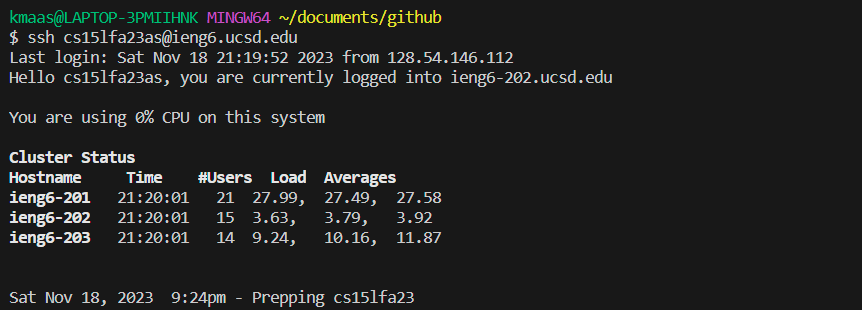
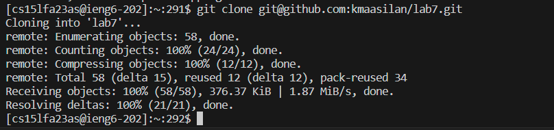
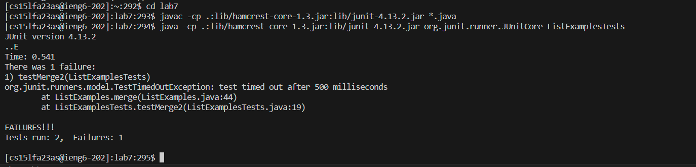
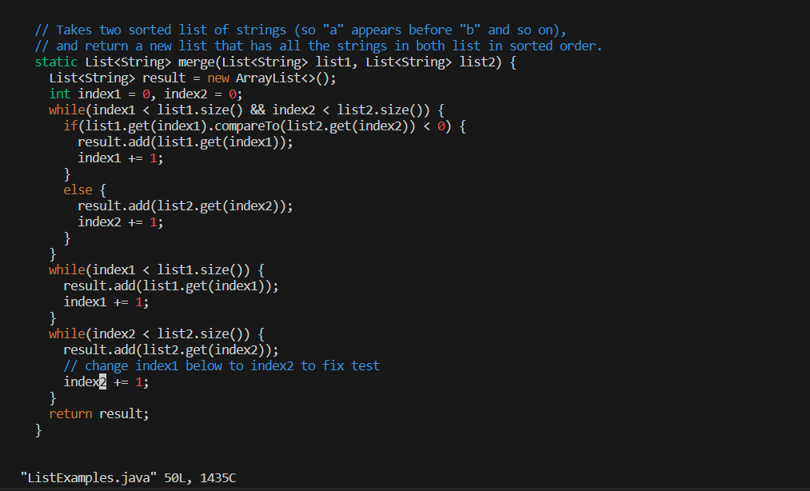
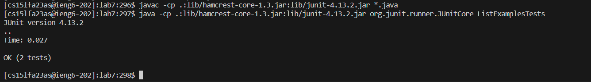
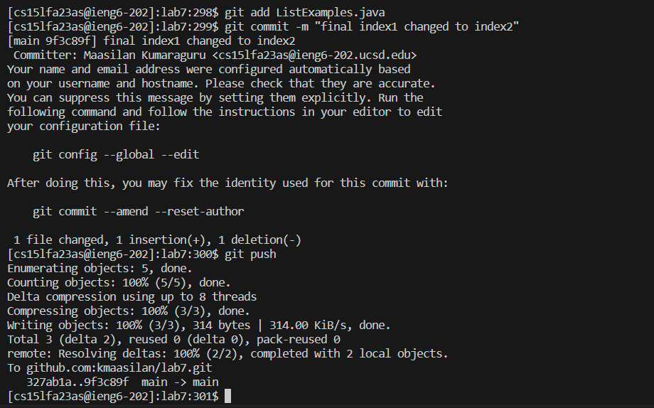

# Lab Report 4 - Vim (Week 7)
## 4. Log into ieng6
* Screenshot: \
  
* Keys pressed: `<ctrl>r` `ssh` `<enter>`. The `<ctrl>r` command allows me to search my terminal history. My ieng6 username comes up when using the search term `ssh`, so I press enter and login to the remote system.
## 5. Clone your fork of the repository from your Github account
* Screenshot: \
  
* Keys pressed: `git clone ` `<ctrl>v` `<enter>`. The `git clone ` command allows me to clone a specified git repository. I specify the git repository with an SSH URL which I had copied earlier and pasted here using `<ctrl>v`. 
## 6. Run the tests, demonstrating that they fail
* Screenshot: \
  
* Keys pressed: \
  `cd lab7` `<enter>`. The `cd` command allows me to change into a specified directory. I specify the directory to be lab7 because I need to compile and run some files within this directory.\
  `<ctrl>r` `javac` `<enter>`. The `<ctrl>r` command allows me to search my terminal history. The JUnit compilation line for `*.java` comes up when using the search term `javac`, so I press enter and compile `ListExamples.java` and `ListExamplesTests.java`.\
  `<ctrl>r` `java -` `<enter>`. The `<ctrl>r` command allows me to search my terminal history. The JUnit execution line for `ListExamplesTests` comes up when using the search term `java -`, so I press enter and execute `ListExamplesTests`.\
## 7. Edit the code file `ListExamples.java` to fix the failing test
* Screenshot: \
  
* Keys pressed: \
  `vim ListExamples.java` `<enter>`. The `vim` command allows me to open a specified file in the vim text editor. I specify the file to be `ListExamples.java` because I need to debug this file.\
  `43$`. The `43$` command in vim normal mode allows me to jump to the end of the 43rd line in the file. This is useful because I need to fix the 44th line in `ListExamples.java`.\
  `/1` `<enter>`. The `/1` command in vim normal mode allows me to jump to the next occurence of `1`. This is useful because I need to replace the 1 in the 44th line of `ListExamples.java` with a 2.\
  `i` `2` `<del>`. The `i` command in vim normal mode allows me to enter insert mode and insert text into the file. I insert 2 and `del`, not `backspace`, 1 so that `index1` in line 44 of `ListExamples.java` becomes `index2`.\
  `<esc>` `:wq` `<enter>`. <esc> allows me to return to normal mode in vim, and the `:wq` command in vim normal mode allows me to save and exit the file.
## 8. Run the tests demonstrating that they now succeed
* Screenshot: \
  
* Keys pressed: \
  `<up><up><up><enter>`. The `<up>` key allows me to access terminal commands I've used previously. Since I ran the JUnit compilation line for `*.java` three commands ago, I press `<up>` three times and press `<enter>` to execute the command.\
  `<up><up><up><enter>`. The `<up>` key allows me to access terminal commands I've used previously. Since I ran the JUnit execution line for `ListExamplesTests` three commands ago, I press `<up>` three times and press `<enter>` to execute the command. `
## 9. Commit and push the resulting change to your Github account
* Screenshot: \
  
* Keys pressed: \
  `git add ` `L<tab><enter>`. The `git add ` command allows me to add changes to a specified file. I specify the `ListExamples.java` file by typing L and using `<tab>` to autocomplete the filename.\
  `git commit -m "final index1 changed to index2"<enter>`. The `git commit ` command allows me to commit changes that have been added. The `-m` option allows me to type out a commit message in the same line without using vim. Here my commit message is `"final index1 changed to index2"`.\
  `git push<enter>` The `git push ` command allows me to push changes that have been committed to the specified git repository. Here I am pushing my changes to `ListExamples.java` to my lab7 repository.
