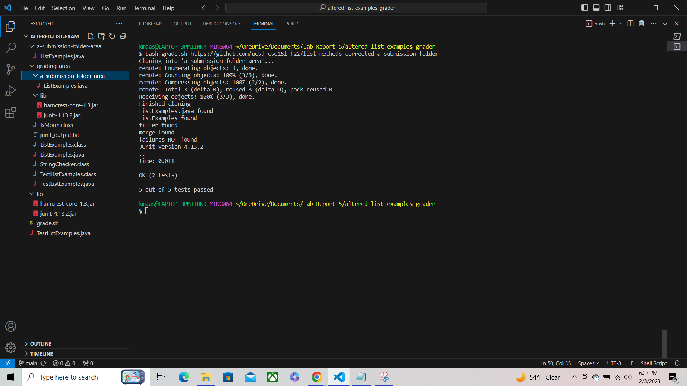
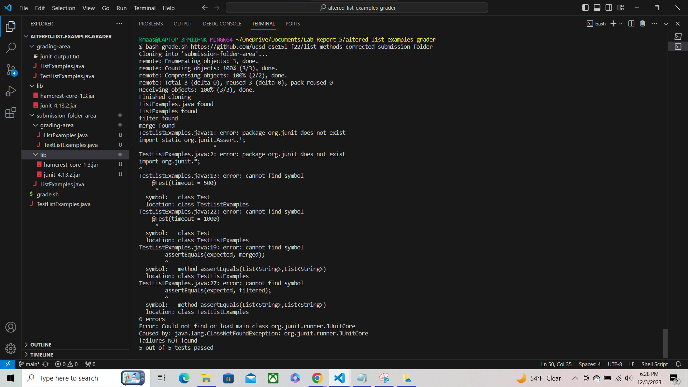
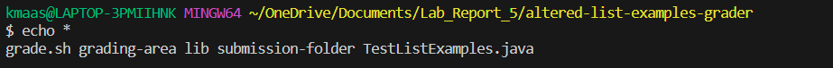
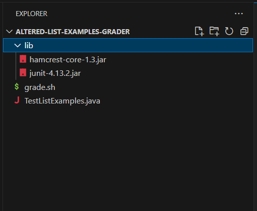

# Lab Report 5 - Putting it All Together (Week 9)
## Part 1 - Debugging Scenario
1. Original post from a student with a screenshot showing a symptom and a description of a guess at the bug/some sense of what the failure-inducing input is: \
___
My bash script works to accomplish the auto grading goals outlined in the week 6 lab ([Here's a link to the week 6 lab](https://ucsd-cse15l-f23.github.io/week/week6/)). However, instead of cloning the specified github repository into a folder strictly named `student-submissions`, my script allows the user to specify part of the name of the folder the github repository will be cloned into. The command used to run this bash script from the terminal while in the altered-list-examples-grader directory is `bash grade.sh <the link of the github repository you want to grade> <part of the name of the folder that will have the github repository's content copied into it>`. \
Bash script code:
```
 1 CPATH='.;lib/hamcrest-core-1.3.jar;lib/junit-4.13.2.jar'
 2 
 3 rm -rf ./*-*
 4 
 5 mkdir grading-area
 6 
 7 git clone $1 $2-area
 8 echo 'Finished cloning'
 9 
10 count=0
11 
12 if ! [[ -f ./$2-area/ListExamples.java ]]
13 then
14     echo 'ListExamples.java NOT found'
15 else
16     echo 'ListExamples.java found'
17     ((count+=1))
18 fi
19 
20 numListExamples=`grep -c 'ListExamples' ./$2-area/ListExamples.java`
21 
22 if [[ $numListExamples -eq 0 ]]
23 then
24     echo 'ListExamples NOT found'
25 else
26     echo 'ListExamples found'
27     ((count+=1))
28 fi
29 
30 numFilter=`grep -c 'filter' ./$2-area/ListExamples.java`
31 
32 if [[ $numFilter -eq 0 ]]
33 then
34     echo 'filter NOT found'
35 else
36     echo 'filter found'
37     ((count+=1))
38 fi
39 
40 numMerge=`grep -c 'merge' ./$2-area/ListExamples.java`
41 
42 if [[ $numMerge -eq 0 ]]
43 then
44     echo 'merge NOT found'
45 else
46     echo 'merge found'
47     ((count+=1))
48 fi
49 
50 cp TestListExamples.java ./$2-area/ListExamples.java ./grading-area
51 cp -r lib ./*-*/
52 
53 cd grading-area
54 
55 javac -cp $CPATH *.java
56 java -cp $CPATH org.junit.runner.JUnitCore TestListExamples > junit_output.txt
57 
58 if [[ `grep -c 'FAILURES!!!' junit_output.txt` -eq 0 ]]
59 then
60     echo 'failures NOT found'
61     ((count+=1))
62 else
63     echo 'failures found'
64 fi
65 
66 cat junit_output.txt
67 
68 echo $count out of 5 tests passed
```
Screenshot of successful output when using the command `bash grade.sh https://github.com/ucsd-cse15l-f22/list-methods-corrected a-submission-folder`: \
 \
Screenshot of error output when using the command `bash grade.sh https://github.com/ucsd-cse15l-f22/list-methods-corrected submission-folder`: \
 \
You can see my Visual Studio Code file browser, my present working directory (`~/OneDrive/Documents/Lab_Report_5/altered-list-grader`), and the entire error message in the screenshots above. \
I expected `bash grade.sh https://github.com/ucsd-cse15l-f22/list-methods-corrected submission-folder` to give the same output as `bash grade.sh https://github.com/ucsd-cse15l-f22/list-methods-corrected a-submission-folder` because the github repository I'm cloning didn't change. The only difference between these two commands is the name of the folder that will have the github repository's content copied into it. I suspect this is an issue with my grade.sh bash script. I'm particularly suspicous of the cp command in line 51 that copies the lib folder into all other folders with a "-" in their name (`cp -r lib ./*-*/`). I specified the dash because I append `-area` to the end of the folder name specified in the command. Also, I don't want to copy the lib folder into the lib folder. 
I'm particularly suspicous of this line because what gets copied where changes depending on the name I specify for the folder that will have the github repository's content copied into it. You can see this in the screen shots I posted above. The file structure after 
running `bash grade.sh https://github.com/ucsd-cse15l-f22/list-methods-corrected submission-folder` is different than the file structure I get after running `bash grade.sh https://github.com/ucsd-cse15l-f22/list-methods-corrected a-submission-folder`, but I'm not
quite sure why that is. \
Any help would be greatly appreciated!
***


2. A response from a TA asking a leading question or suggesting a command to try: 
***
Hello Maasilan! \
I think you're misunderstanding how the cp command works. Read more about the cp command [here at this link](https://www.geeksforgeeks.org/cp-command-linux-examples/). Also try to think about what `*` does; maybe run the command `echo * `! \
Hopefully this helps! \
Sincerely, \
Nalisaam 
***


3. Another screenshot/terminal output showing what information the student got from trying that, and a clear description of what the bug is: 
***
 \
It looks like `*` expansions are listed in alphabetical order. Furthermore, according to [this link](https://serverfault.com/questions/122737/in-bash-are-wildcard-expansions-guaranteed-to-be-in-order), 
`*` expansions are listed in alphabetical order. \
Also, you were right that I was misunderstanding the cp command. Apparrently if you run the cp command like `cp -r folder1 folder2 folder3`, it copies 
`folder1` and `folder2` into `folder3`. This is important because I ran `cp -r lib ./*-*/`, and expansions are listed in alphabetical order. This means my first command 
`bash grade.sh https://github.com/ucsd-cse15l-f22/list-methods-corrected a-submission-folder` leads to `cp -r lib ./*-*/`
expanding into `cp -r lib a-submission-folder-area grading-area`. Thus, both `lib` and `a-submission-folder-area` are copied into `grading-area`, so when 
`grade.sh` assumes `lib` is in `grading area` and runs... 
```
cd grading-area

javac -cp $CPATH *.java
java -cp $CPATH org.junit.runner.JUnitCore TestListExamples > junit_output.txt
```
in lines 53-56, the assumption is correct and the script works. However, my second command `bash grade.sh https://github.com/ucsd-cse15l-f22/list-methods-corrected a-submission-folder` causes `cp -r lib ./*-*/` to expand into 
`cp -r lib grading-area submission-folder-area`. Thus, both `lib` and `grading-area` are copied into `submission-folder-area`, so when
`grade.sh` assumes `lib` is in `grading` area and runs...
```
cd grading-area

javac -cp $CPATH *.java
java -cp $CPATH org.junit.runner.JUnitCore TestListExamples > junit_output.txt
```
in lines 53-56, the assumption is wrong and the script fails. This is why our terminal output after running
`bash grade.sh https://github.com/ucsd-cse15l-f22/list-methods-corrected submission-folder` is: \
 \
All of these errors stem from the fact that the `lib` folder isn't in the `grading-area` directory
when we compile `TestListExamples.java`. In fact, it clearly states `TestListExamples.java: error:
package org.junit does not exist`. Without the lib directory it can't compile 
`TestListExamples.java`, so it prints all these errors relating to methods and other things 
defined in the .jar files in the `lib` repository. Some examples include:
```
TestListExamples.java:19: error: cannot find symbol
        assertEquals(expected, merged);
        ^
  symbol:   method assertEquals(List<String>,List<String>)
  location: class TestListExamples
```
and...
```
TestListExamples.java:22: error: cannot find symbol
    @Test(timeout = 1000)
     ^
  symbol:   class Test
  location: class TestListExamples
```
Without the lib repository, methods and things like `assertEquals` and `@Test` make no sense
to the compiler. 
***


4. All the information needed about the setup including:
***
* The file & directory structure needed: \
   \
  This is the required file and directory structure needed to run grade.sh.
* The contents of each file before fixing the bug:
  The grade.sh code was already posted in a code block above, but here it is again :) ...
  ```
   1 CPATH='.;lib/hamcrest-core-1.3.jar;lib/junit-4.13.2.jar'
   2 
   3 rm -rf ./*-*
   4 
   5 mkdir grading-area
   6 
   7 git clone $1 $2-area
   8 echo 'Finished cloning'
   9 
  10 count=0
  11 
  12 if ! [[ -f ./$2-area/ListExamples.java ]]
  13 then
  14     echo 'ListExamples.java NOT found'
  15 else
  16     echo 'ListExamples.java found'
  17     ((count+=1))
  18 fi
  19 
  20 numListExamples=`grep -c 'ListExamples' ./$2-area/ListExamples.java`
  21 
  22 if [[ $numListExamples -eq 0 ]]
  23 then
  24     echo 'ListExamples NOT found'
  25 else
  26     echo 'ListExamples found'
  27     ((count+=1))
  28 fi
  29 
  30 numFilter=`grep -c 'filter' ./$2-area/ListExamples.java`
  31 
  32 if [[ $numFilter -eq 0 ]]
  33 then
  34     echo 'filter NOT found'
  35 else
  36     echo 'filter found'
  37     ((count+=1))
  38 fi
  39 
  40 numMerge=`grep -c 'merge' ./$2-area/ListExamples.java`
  41 
  42 if [[ $numMerge -eq 0 ]]
  43 then
  44     echo 'merge NOT found'
  45 else
  46     echo 'merge found'
  47     ((count+=1))
  48 fi
  49 
  50 cp TestListExamples.java ./$2-area/ListExamples.java ./grading-area
  51 cp -r lib ./*-*/
  52 
  53 cd grading-area
  54 
  55 javac -cp $CPATH *.java
  56 java -cp $CPATH org.junit.runner.JUnitCore TestListExamples > junit_output.txt
  57 
  58 if [[ `grep -c 'FAILURES!!!' junit_output.txt` -eq 0 ]]
  59 then
  60     echo 'failures NOT found'
  61     ((count+=1))
  62 else
  63     echo 'failures found'
  64 fi
  65 
  66 cat junit_output.txt
  67 
  68 echo $count out of 5 tests passed
  ```
  The content of files other than grade.sh is irrelevant, but I have posted some these files' contents below... \
  TestListExamples.java:
  ```
  import static org.junit.Assert.*;
  import org.junit.*;
  import java.util.Arrays;
  import java.util.List;
  
  class IsMoon implements StringChecker {
      public boolean checkString (String s) {
          return s.equalsIgnoreCase("moon");
      }
  }
  
  public class TestListExamples {
      @Test(timeout = 500)
      public void testMergeRightEnd() {
          List<String> left = Arrays.asList("a", "b", "c");
          List<String> right = Arrays.asList("a", "d");
          List<String> merged = ListExamples.merge(left, right);
          List<String> expected = Arrays.asList("a", "a", "b", "c", "d");
          assertEquals(expected, merged);
      }
  
      @Test(timeout = 1000) 
      public void testFilter() {
          List<String> tempList = Arrays.asList("moon", "a", "b");
          List<String> filtered = ListExamples.filter(tempList, new IsMoon());
          List<String> expected = Arrays.asList("moon");
          assertEquals(expected, filtered);
      }
  }
  ```
  junit_output.txt is empty, and the contents of the remaining files were cloned from [the github repository linked here](https://github.com/ucsd-cse15l-f22/list-methods-corrected). 
* The full command line (or lines) you ran to trigger the bug:
  `bash grade.sh https://github.com/ucsd-cse15l-f22/list-methods-corrected submission-folder`
* A description of what to edit to fix the bug:
  At line 51, change `cp -r lib ./*-*/` to `cp -r lib ./grading-area`.
***

## Part 1 - Reflection
I learned about the jdb debugger in the second half of this quarter. Basically, I used the
jdb debugger to fix java programs. I thought it was interesting how jdb allowed me 
to step through java programs and collect more information about bugs. Specifically,
I thought it was cool how jdb ran in the terminal in its own terminal-esque command line
interface. I wish I knew about debuggers like jdb before because they would've saved me
a lot of time! Commands like `locals`, `where`, and `print <variable name>` are very useful for
smaller projects and are probably immensely useful for larger scale projects. Specifically, I
learned `print <specified variable>` prints the value of a specified variable at the current 
point in the program, `thread <specified number>` lets you specify which thread you want
to access, and `suspend` stops jdb when it encouters an infinite loop in your program. These commands are very
useful and I hope they help me in the future!
